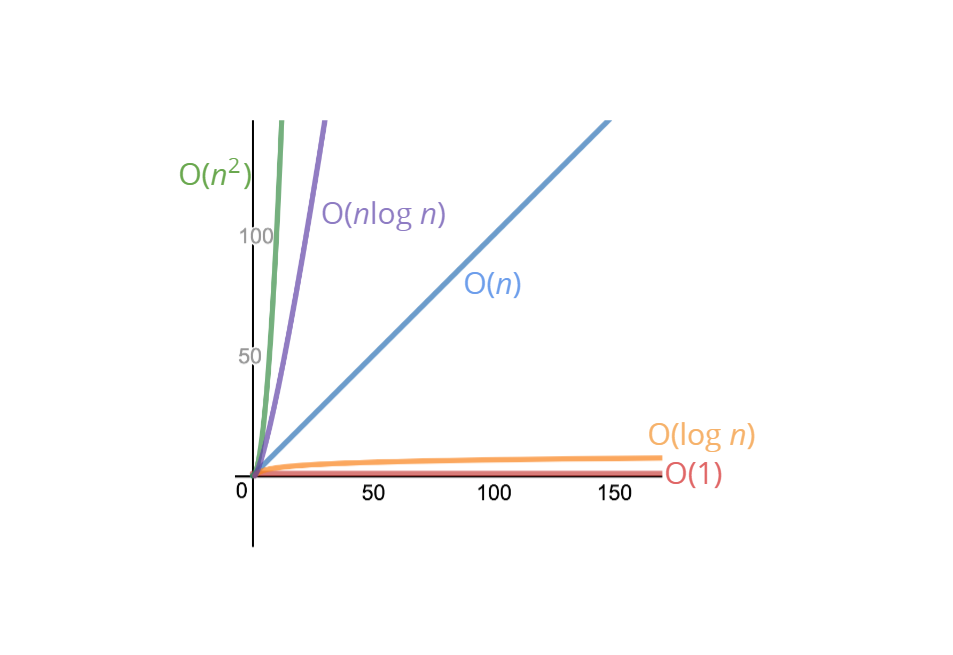

# Big O Notation

- [Big O Notation](#big-o-notation)
  - [What's Big O Notation?](#whats-big-o-notation)
  - [Space Complexity](#space-complexity)
    - [Rules of Thumb](#rules-of-thumb)
  - [Resources](#resources)

## What's Big O Notation?



Big O Notation is a tool used to describe the time complexity of algorithms. It calculates the time taken to run an algorithm as the input grows. In other words, it calculates the worst-case time complexity of an algorithm. Big O Notation in Data Structure describes the upper bound of an algorithm's runtime.

> Example
> Suppose we want to write a function that calculates the sum of all numbers from 1 up to (and including) some number n.

Solution #1
Time complexity: O(n)

```java
class AddUpTo1 {
  public static void main(String[] args) {

    long number = 3;

    long total = addUpTo(number);
    System.out.println("Total: " + total);
  }

  public static long addUpTo(long n) {
    long total = 0;
    for (int i = 1; i <= n; i++) {
      total += i;
    }
    return total;
  }
}
```

Solution #2
Time complexity: O(1)

```java
class AddUpTo2 {
  public static void main(String[] args) {

    long number = 3;

    long total = addUpTo(number);
    System.out.println("Total: " + total);
  }

  public static long addUpTo(long n) {
    return n * (n + 1) / 2;
  }
}
```

Here's how to track performance of the above two solutions: [link](https://rithmschool.github.io/function-timer-demo/)

## Space Complexity

### Rules of Thumb

- Most primitives (booleans, numbers, undefined, null) are constant space
- Strings require O(n) space (where n is the string length)
- Reference types are generally O( n), where n is the length (for arrays) or the number of keys (for objects)

> Example 1

Space complexity: O(1) space

```java
public class Sum {
  public static int sum(int[] arr) {
    int total = 0;
    for (int i = 0; i < arr.length; i++) {
      total += arr[i];
    }
    return total;
  }
}
```

> Example 2

Space complexity: O(n) space

```java
public class Double {
  public static int[] doubleElements(int[] arr) {
    int[] newArr = new int[arr.length];
    for (int i = 0; i < arr.length; i++) {
      newArr[i] = arr[i] * 2;
    }
    return newArr;
  }
}
```

## Resources

- [Slides about Big O by Colt Steele](https://cs.slides.com/colt_steele/big-o-notation)
